<!-- markdown: true -->

## Azure で Hyper-V を動作させる
Azure VMにHyper-vの役割を持たせ、その上でVMを動かします。
この機能を Nested Virtualizationといいます。
VM on Hyper-V on Azure VMの構成になります。

## Hyper-Vを動かせるVMの作成
以下を参考にして、Windows Server 2025および2019のDatacenterエディションを作成します。
https://qiita.com/carol0226/items/b5ca1ec882742e208e00

その後色々して、Nested Virtualな環境を作ります。

---
## 実際に作成したVM (Windows Server 2019)
VM2019test002, VM2019test003を作成しました。
(test001はミスです)
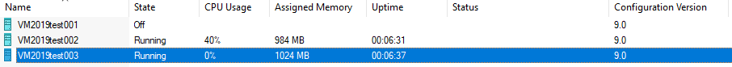

バージョンが9.0(Windows Server 2019のデフォルト)になっています。

---

## 実際に作成したVM (Windows Server 2025)
VM2025test001, VM2025test002を作成しました
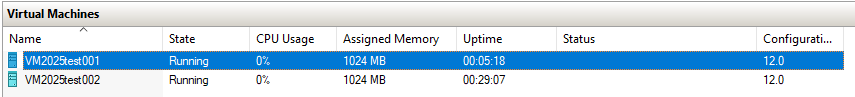

バージョンが12.0(Windows Server 2025のデフォルト)になっています。

---

## マイグレーションしてみる (2019 ⇢ 2025)
簡単のため、Hyper-Vマネージャ上で操作を完結させます。

VM2019test002を右クリックし、エクスポートを選択します。
(起動状態でエクスポートしていますが、停止状態でエクスポートしないとうまくいかったため、停止してからやり直しました。)
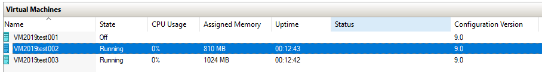

エクスポートしたフォルダを、Windows Server 2025のHyper-Vマネージャでインポートします。
仮想スイッチと読みに行くisoファイルのパスだけ変えてあげて、起動します。
(うまくisoファイルを読みにいってくれず、2時間浪費しました。VMの設定 > SCSIコントローラ > Hard Drive の設定画面から該当ドライブをアンマウントしてからVMを起動し、後付けでディスクを挿入してあげるとうまくインストーラが動きました。)

Hyper-Vマネージャ上でVM2019test002が検出されました！
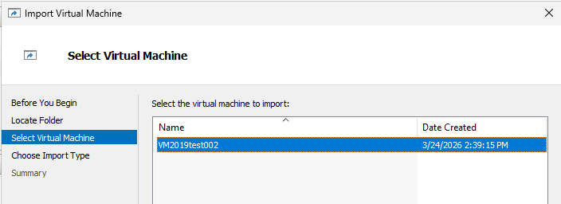

起動します。
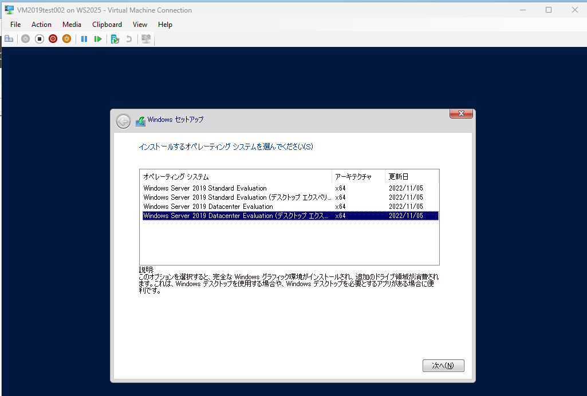
左上に VM2019test002 on WS2025 - Virtual Machine Connectionと表示され、インストーラが起動しました。
マイグレーション成功とします。

## マイグレーションしてみる (2025 ⇢ 2019)
VM2025test001をインポートします。
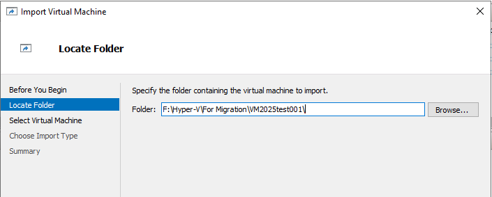

VM2025test001が検出されません。
SCVMMなどでマイグレーションした場合はエラーが出るかもしれませんが、手作業でファイルを移動したためHyper-Vマネージャ上では特に何も表示されませんでした...。
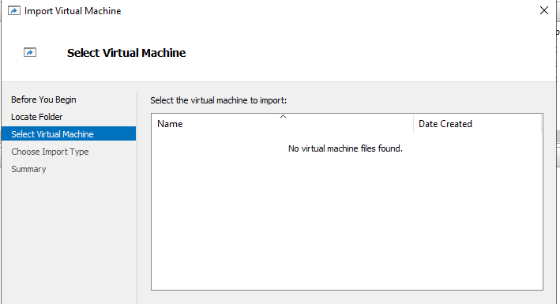

少し粘ります。
新しい仮想マシンnewVM2025test001を作成します。
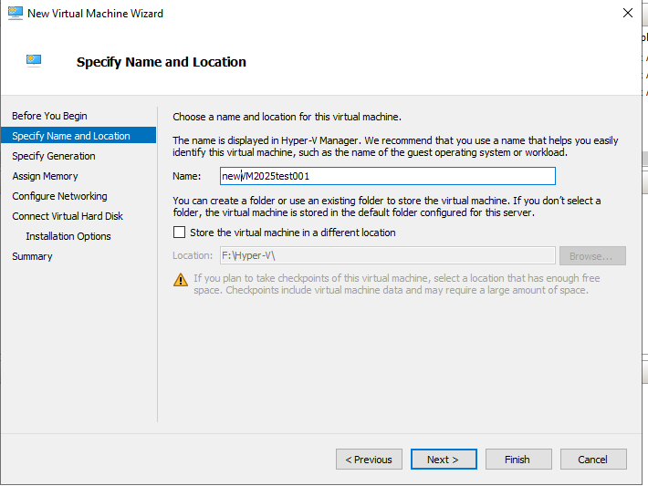

VM2025test001.vhdxを読み込むように設定します。
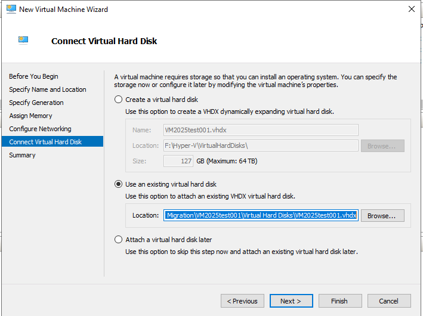

バージョン9.0のnewVM2025test001が作成されました。
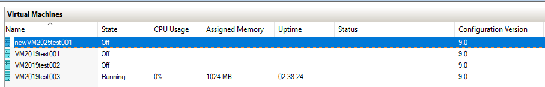

インストーラが起動します。
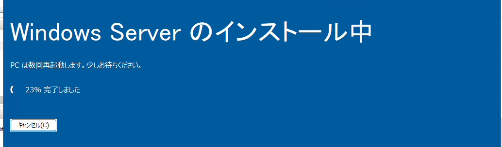
マイグレーション成功とします (実際に動くはず..??)。

### 補足
Windows Server 2025では、VMの構成バージョン8.0以降をサポートしているため、エクスポートしたvhdxファイルを使ってサポートされた構成バージョンのVMを作成することでマイグレーションが可能となりました。
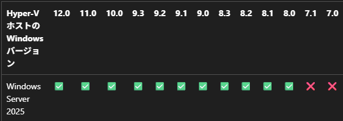

以上。
